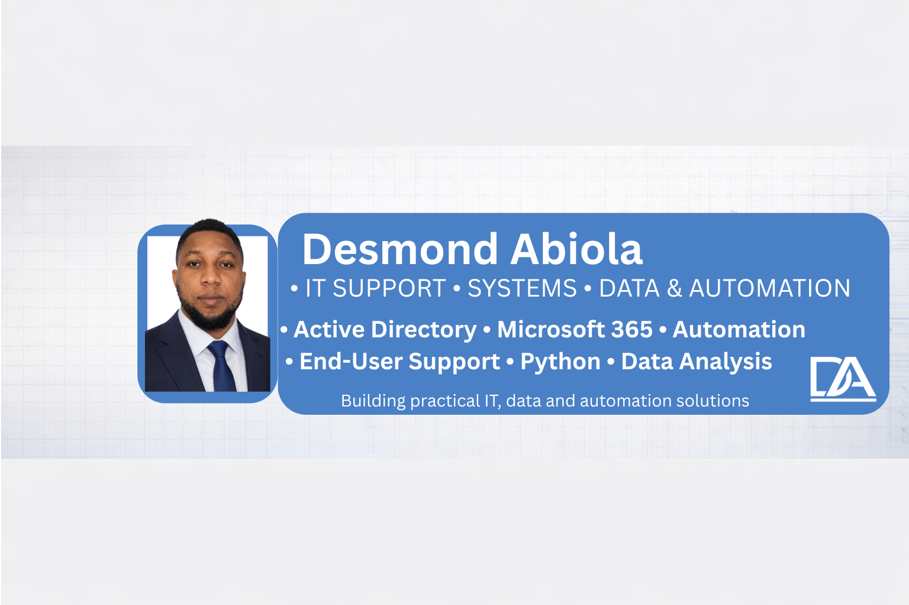

  

## About Me

I’m an IT Support-focused professional with hands-on experience working with Active Directory, Microsoft 365, Windows environments, and networking.

I enjoy troubleshooting technical issues, identifying root causes, and helping users get back to work quickly.

This portfolio documents the labs and support scenarios I’ve worked through while building practical, job-ready experience for IT Support and Junior SysAdmin roles.

---

## IT Support Portfolio

This repository showcases the hands-on labs and support scenarios I’ve worked through while practising real IT support tasks.

The focus isn’t just on setting things up. I’m also interested in understanding what goes wrong, finding the root cause, fixing the issue, and documenting the process clearly.

---

## Overview

The portfolio covers areas commonly found in IT Support and Junior SysAdmin environments, including:

- Supporting users with login and access issues
- Managing accounts in Active Directory and Microsoft 365
- Troubleshooting Windows system problems
- Investigating network issues such as DNS, connectivity, and access
- Resolving scenarios involving shared folders, slow systems, and update failures

Each lab is structured around a practical support scenario — starting with the reported issue, investigating what is happening, identifying the root cause, applying a fix, and verifying the result.

---

## Lab Environment

To simulate a realistic working environment, I built a small lab using:

- Windows Server (Domain Controller with Active Directory & DNS)
- Windows client machine (user workstation simulation)
- Ubuntu Linux server
- VirtualBox internal network

This setup gives me a controlled environment where I can practise how users, systems, and network services interact.

---

## Skills Practiced

Across these labs, I’ve worked on:

- Managing users, groups, and access in Active Directory
- Handling Microsoft 365 user accounts, licensing, and mailbox issues
- Troubleshooting Windows systems, including performance and updates
- Diagnosing DNS, DHCP, VPN, and connectivity issues
- Configuring Group Policy for drive mapping and access control
- Investigating Exchange Online and Outlook-related issues
- Testing basic Linux integration within an Active Directory environment
- Following a structured approach to troubleshooting and incident handling
- Using PowerShell and Python for simple automation tasks

---

## Example Scenarios

Some of the scenarios I’ve worked through include:

- User unable to log in to the domain
- Shared folder showing "Access Denied"
- Microsoft 365 login or mailbox issues
- DNS not resolving internal resources
- VPN connected but unable to access internal systems
- Windows Update failing to install
- Slow system performance
- Malware detection and cleanup

---

## How I Approach Problems

For each issue, I try to follow a consistent troubleshooting process:

1. Understand what the user is experiencing
2. Check the basics, including connectivity and system status
3. Investigate configurations and settings
4. Identify the root cause
5. Apply an appropriate fix
6. Verify that the issue has been resolved

---

## Purpose

I built this portfolio to move beyond simply learning IT concepts and start practising them in realistic scenarios.

My focus is on:

- Solving technical issues step by step
- Understanding why problems happen
- Documenting troubleshooting clearly
- Building practical experience with common IT Support tools and technologies
- Developing the problem-solving skills needed in a real support environment

---

## Where to Start

If you're reviewing this portfolio for an IT Support or Junior SysAdmin role, these are good places to start:

- Active Directory File Server Access Troubleshooting
- Microsoft 365 Identity Lifecycle Automation
- DNS Resolution Failure in Active Directory
- DHCP IP Assignment Issue
- Exchange Online Incident Investigation
- Python Automation for IT Support Tasks
